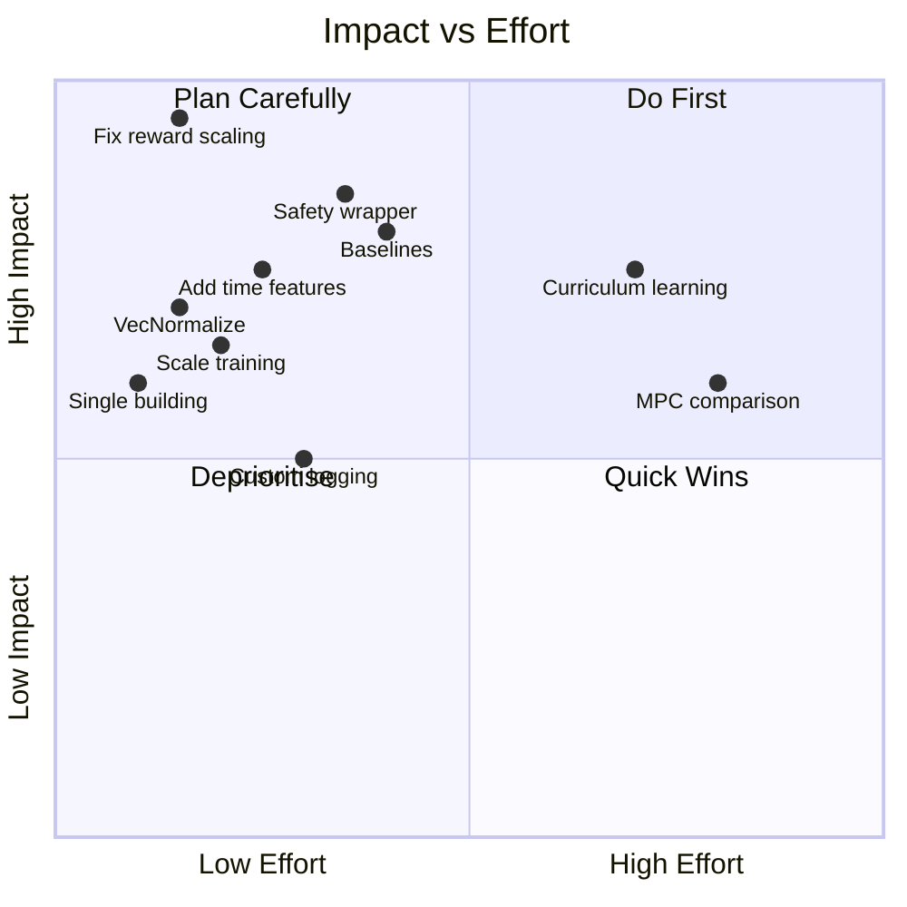

# 🔬 Senior RL Engineer Codebase Analysis & Roadmap

## Executive Summary

Your system trains a **SAC** (Soft Actor-Critic) agent to control a heat pump's supply temperature to minimise electricity cost while maintaining room comfort. The physics pipeline (4R3C building model + iDM heat pump COP model + ODE simulator) is **solid foundational work**. But the RL layer — reward shaping, observation design, training configuration, and evaluation — has several critical issues that are limiting your results.

**Current performance (from eval_v3_test.png):**
- Comfort: **76.9%** (should be ≥ 95% for a deployable controller)
- Cost: **€2975.92** over ~2 years
- HP cycles: **2372** (excessive — causes compressor wear)
- The T_room trace is noisy and frequently dips below 20°C

Below is a detailed analysis of every component, what's wrong, and a phased roadmap to fix it.

---

## 1. 🚨 Critical Issues (Must Fix)

### 1.1 Broken Reward Scaling — `1/1000` kills the signal

**File:** [room_env.py:298](file:///Users/arjun/Arjun%20files/h_da/sem2/team%20project/tim/heatpump_building/src/room_env.py#L285-L312)

```python
scale = 1/1000   # ← This destroys the reward magnitude

return scale * float(self.comfort_weight * comfort - cost_penalty - cycle_penalty)
```

With `comfort_weight=10.0` and `scale=1/1000`, when the room is comfortable you get a reward of `10.0 * 1.0 / 1000 = 0.01`. A typical electricity cost is `0.25 * 2.0 = 0.50 €`, so the cost penalty **dominates by 50×**. The agent learns to **never heat** because saving money gives a larger reward than maintaining comfort.

> [!CAUTION]
> This single issue likely explains 80%+ of your 76.9% comfort rate. The agent has no incentive to heat because comfort reward is negligibly small relative to cost.

**Fix:** Remove the `1/1000` scale or rebalance weights entirely.

---

### 1.2 Reward Function Architecture is Flawed

**File:** [room_env.py:285-312](file:///Users/arjun/Arjun%20files/h_da/sem2/team%20project/tim/heatpump_building/src/room_env.py#L285-L312)

Current reward:
```
r = (1/1000) * [comfort_weight * comfort_term - price * E_el - cycle_penalty]
```

**Problems:**
| Issue | Why it matters |
|-------|---------------|
| **Flat +1.0 in comfort band** | No gradient to guide the agent toward the sweet spot. At 20.001°C and 21.999°C the agent gets the same reward — no incentive to stay centered. |
| **Asymmetric penalty** | Overheating (26°C) and underheating (14°C) are penalised by `-(T-21)²`. Underheating is the dangerous failure mode and should be penalised **much** more heavily. |
| **Comfort and cost are incommensurable** | `comfort` is unitless (0 to 1), `cost` is in € (0.0 to ~1.0). Mixing them without normalisation makes tuning `comfort_weight` a guessing game. |
| **No time-of-use awareness** | The reward doesn't distinguish between shifting load to cheap hours vs. not heating at all. The agent should be rewarded for *pre-heating* during cheap hours. |

---

### 1.3 Observation Space Missing Critical Features

**File:** [room_env.py:7-13](file:///Users/arjun/Arjun%20files/h_da/sem2/team%20project/tim/heatpump_building/src/room_env.py#L7-L13), [room_env.py:274-283](file:///Users/arjun/Arjun%20files/h_da/sem2/team%20project/tim/heatpump_building/src/room_env.py#L274-L283)

Current observation (53 dims):
```
[T_room, T_wall, T_hp_ret, T_amb, price, price_forecast×24, T_amb_forecast×24]
```

**Missing features that would dramatically help:**
| Feature | Why |
|---------|-----|
| **Hour of day (sin/cos encoded)** | Prices have strong diurnal patterns. Without time encoding, the agent can't learn "heat now because prices go up at 6pm." |
| **Day of week** | Weekend vs. weekday prices differ significantly. |
| **Previous action** | The agent has no memory of what it just did — essential for avoiding oscillation. |
| **HP on/off state** | Related to cycle penalty — the agent should know if the HP is currently running. |
| **Cumulative comfort deviation** | Helps the agent track how much "comfort debt" it has accumulated. |

---

### 1.4 Domain Randomisation Breaks Training Signal

**File:** [room_env.py:143-166](file:///Users/arjun/Arjun%20files/h_da/sem2/team%20project/tim/heatpump_building/src/room_env.py#L143-L166)

```python
def _select_models(self):
    bldg_idx = int(self.np_random.integers(0, len(self.building_models)))
    hp_idx = int(self.np_random.integers(0, len(self.heatpump_models)))
```

Every `reset()` picks a random building from 11 models and a random heat pump. The building thermal constants vary by **10×** (e.g. `H_tr` ranges from 142 to 973 W/K). This means:
- The optimal policy for a 1919 leaky house is completely different from a 2016 passive house
- The agent receives contradictory training signals
- SAC struggles to learn a single policy that works across such diverse dynamics

> [!WARNING]
> Currently, you have `HEATPUMP_MODELS` imported from `heatpump_model.py`, but after deleting the `i4b_*` classes and the `HEATPUMP_MODELS` list, **this will crash** on `from models.heatpump_model import HEATPUMP_MODELS`.

**Fix:** Train on a single building first, then use curriculum learning to introduce variations gradually.

---

## 2. ⚠️ Training Pipeline Issues

### 2.1 SAC Hyperparameters Are Suboptimal

**File:** [train_SAC.py:166-180](file:///Users/arjun/Arjun%20files/h_da/sem2/team%20project/tim/heatpump_building/train_SAC.py#L166-L180)

| Parameter | Current | Recommended | Reason |
|-----------|---------|-------------|--------|
| `timesteps` | 100k | **2M–5M** | 100k is far too few for a 53-dim obs space with 24h forecast horizon |
| `buffer_size` | 100k | **500k–1M** | Off-policy needs large diverse buffer |
| `learning_starts` | 5k | **10k–25k** | More random exploration before training begins |
| `batch_size` | 256 | **512** | Larger batches smooth gradient noise |
| `learning_rate` | 1e-4 | **3e-4** | SAC default; 1e-4 is conservative |
| `gamma` | 0.99 | **0.995–0.997** | 24h episode with hourly steps needs longer horizon discount |
| `policy` | `MlpPolicy` | Custom `net_arch` | Default is [256, 256]; try [512, 512] or [256, 256, 256] for the complex observation space |

### 2.2 Only 1 Training Environment

**File:** [train_SAC.py:141](file:///Users/arjun/Arjun%20files/h_da/sem2/team%20project/tim/heatpump_building/train_SAC.py#L141)

```python
train_env = DummyVecEnv([make_env(train_data, args, random_init=True)])
```

Using a single environment is extremely slow for sample collection. Use **4–8 parallel environments** to speed up training by 4–8×.

### 2.3 No Observation/Reward Normalisation

SB3 provides `VecNormalize` which normalises observations and rewards using running statistics. This is **critical** for SAC performance — raw observations span wildly different ranges (T_room: 5–60°C, price: -0.5–2.0 €/kWh).

### 2.4 No Learning Rate Schedule

A constant learning rate often leads to instability late in training. Use a linear or cosine decay schedule.

---

## 3. 🔧 Physics/Simulation Improvements

### 3.1 Modulation Floor Logic Mismatch

**File:** [simulator.py:117-126](file:///Users/arjun/Arjun%20files/h_da/sem2/team%20project/tim/heatpump_building/src/simulator.py#L117-L126)

```python
Q_MOD_MIN = 4000.0  # W
if Qdot_th >= Q_MOD_MIN / 2.0:
    Qdot_th = max(Qdot_th, Q_MOD_MIN)  # snap up
    hp_on = True
else:
    Qdot_th = 0.0  # snap down
    hp_on = False
```

The 2 kW threshold (half of 4 kW) is arbitrary. Real inverter-driven heat pumps modulate continuously down to ~30% of rated capacity. This binary snap creates a **discontinuity** that makes the reward landscape harder for the agent to navigate.

**Fix:** Model continuous modulation with a smooth min-power ramp.

### 3.2 Heating Cutoff Logic Masks Agent Learning

**File:** [room_env.py:195-202](file:///Users/arjun/Arjun%20files/h_da/sem2/team%20project/tim/heatpump_building/src/room_env.py#L195-L202)

```python
if pk['T_amb'] < self.bldg_model.params['T_amb_lim']:
    T_hp_sup = max(T_hp_sup + T_offset, state_dict['T_hp_ret'])
else:
    T_hp_sup = state_dict['T_hp_ret']  # force HP off
```

When outdoor temperature exceeds `T_amb_lim` (20°C), the env **overrides the agent's action** and forces the HP off. This is fine for summer, but:
- The agent doesn't know this rule exists (it's not in the observation)
- It gets "free" comfort during warm periods, inflating the comfort metric
- The `T_offset` addition is building-specific (ranges from -8 to +15°C) and makes the action mapping inconsistent across domain-randomised buildings

---

## 4. 📊 Evaluation & Baselines Missing

### 4.1 No Rule-Based Baseline

You have no comparison against simple controllers:
- **Heating curve controller**: T_supply = f(T_outdoor) — industry standard
- **Constant setpoint**: Always heat to 21°C
- **Night setback**: Heat to 21°C daytime, 18°C night

Without baselines, you can't tell if 76.9% comfort at €2975 is good or terrible.

### 4.2 No Proper Metrics Tracking

The evaluation only computes total energy, cost, comfort %, and HP cycles. Missing:
- **Comfort-violation hours** (Kh): Accumulated degree-hours below setpoint — the standard metric in building energy
- **Cost per unit comfort**: €/comfortable-hour
- **Peak demand**: Maximum instantaneous power draw
- **Price-weighted vs. flat-rate comparison**: Shows how much the agent saves by load-shifting

---

## 5. 🗺️ Phased Improvement Roadmap

### Phase 1: Fix the Fundamentals (1–2 days)
> *Expected impact: Comfort 76.9% → 90%+*

| # | Task | File(s) | Details |
|---|------|---------|---------|
| 1.1 | **Fix reward scaling** | `room_env.py` | Remove `scale = 1/1000`. Redesign reward as: `r = -α * violation² - β * price * E_el - γ * cycle_event` with α=5.0, β=1.0, γ=0.5 |
| 1.2 | **Fix `HEATPUMP_MODELS` import** | `heatpump_model.py`, `room_env.py` | You deleted the classes but the import still references `HEATPUMP_MODELS`. Either restore the list with only `iDM_AERO_ALM_4_12`, or change room_env.py to instantiate directly. |
| 1.3 | **Train on single building** | `room_env.py` | Fix building to `vonovia_model` only. Remove domain randomisation for now. |
| 1.4 | **Add time features to obs** | `room_env.py` | Add `sin(hour)`, `cos(hour)`, `sin(day_of_week)`, `cos(day_of_week)`, `previous_action` — 5 extra dims. |
| 1.5 | **Add VecNormalize** | `train_SAC.py` | Wrap env with `VecNormalize(env, norm_obs=True, norm_reward=True, clip_obs=10.0)` |

### Phase 2: Training Pipeline (2–3 days)
> *Expected impact: Comfort → 95%+, meaningful cost savings*

| # | Task | File(s) | Details |
|---|------|---------|---------|
| 2.1 | **Scale up training** | `train_SAC.py` | Increase to 2M timesteps, buffer 500k, learning_starts 20k |
| 2.2 | **Parallel envs** | `train_SAC.py` | Use `SubprocVecEnv` with 4–8 workers |
| 2.3 | **Custom network** | `train_SAC.py` | `policy_kwargs=dict(net_arch=dict(pi=[512, 512], qf=[512, 512]))` |
| 2.4 | **Implement baselines** | `baselines.py` (NEW) | Heating curve controller + constant setpoint baseline |
| 2.5 | **Gamma tuning** | `train_SAC.py` | Increase gamma to 0.995 for 24h+ lookahead |
| 2.6 | **LR schedule** | `train_SAC.py` | Linear decay from 3e-4 → 1e-5 |
| 2.7 | **Custom logging callback** | `train_SAC.py` | Log T_room, comfort %, cost, HP cycles to TensorBoard per episode |

### Phase 3: Advanced Reward Engineering (1–2 days)
> *Expected impact: Smart load-shifting, reduced HP cycles*

| # | Task | File(s) | Details |
|---|------|---------|---------|
| 3.1 | **Asymmetric comfort penalty** | `room_env.py` | Penalise underheating 3× more than overheating |
| 3.2 | **Pre-heating bonus** | `room_env.py` | Small bonus for maintaining T_room in [20.5, 21.5] during next 3 hours of high prices |
| 3.3 | **Smooth cycle penalty** | `room_env.py` | Replace binary on/off cycle penalty with action-smoothness penalty: `-(a_t - a_{t-1})²` |
| 3.4 | **Normalise cost to daily average** | `room_env.py` | Divide cost by running mean price so the agent optimises relative cost, not absolute € |

### Phase 4: Generalisation & Robustness (3–5 days)
> *Expected impact: Policy works across buildings and seasons*

| # | Task | File(s) | Details |
|---|------|---------|---------|
| 4.1 | **Curriculum learning** | `train_SAC.py`, `room_env.py` | Start with `vonovia_model`, add harder buildings every 500k steps |
| 4.2 | **Building ID in observation** | `room_env.py` | One-hot encode which building is active (11 dims) so the agent can adapt its policy |
| 4.3 | **Noise injection** | `room_env.py` | Use `noise_level=0.1` for sensor noise robustness |
| 4.4 | **Weather uncertainty** | `room_env.py` | Add noise to forecast observations (forecasts are imperfect in reality) |
| 4.5 | **Seasonal evaluation** | `evaluate.py` | Split evaluation by season (DJF, MAM, JJA, SON) to identify winter-specific failures |

### Phase 5: Production-Ready (3–5 days)
> *Expected impact: Deployable MPC-like controller*

| # | Task | File(s) | Details |
|---|------|---------|---------|
| 5.1 | **Safety wrapper** | `safety_wrapper.py` (NEW) | Hard-clip T_room: if `T_room < 18°C`, override agent and heat to 22°C. Never deploy unconstrained RL. |
| 5.2 | **Online fine-tuning** | `online_adapt.py` (NEW) | Continue training on real live data with small LR |
| 5.3 | **MPC comparison** | `baselines.py` | Implement a simple 24h MPC with perfect forecast as the upper bound for what's achievable |
| 5.4 | **Dashboard integration** | `dashboard.py` | Show RL agent predictions alongside actual data, with cost savings tracker |
| 5.5 | **Model versioning** | `train_SAC.py` | Save training config + env params alongside model for reproducibility |

---

## 6. 📁 Proposed Final File Structure

```
heatpump_building/
├── configs/
│   ├── default.yaml           # All hyperparams in one place
│   └── sweep.yaml             # Optuna/WandB sweep configs
├── src/
│   ├── room_env.py            # Cleaned environment
│   ├── simulator.py           # Physics engine
│   ├── reward.py              # Reward function (extracted, testable)
│   ├── observation.py         # Observation builder (extracted)
│   ├── wrappers/
│   │   ├── safety_wrapper.py  # Hard comfort constraints
│   │   └── normalize.py       # Custom normalisation
│   ├── baselines/
│   │   ├── heating_curve.py   # Standard heating curve controller
│   │   ├── constant_setpoint.py
│   │   └── mpc_baseline.py    # Simple MPC for upper bound
│   └── data_collectors/
│       ├── get_temp.py
│       └── get_entsoe_tibber_price_hourly.py
├── models/
│   ├── vonovia_model.py       # Building physics
│   └── heatpump_model.py      # HP COP model
├── train_SAC.py               # Training entry point
├── evaluate.py                # Evaluation + plotting
├── compare_baselines.py       # Compare RL vs. baselines
└── dashboard/
    └── dashboard.py           # Streamlit app
```

---

## 7. 🎯 Priority Matrix



---

## 8. Summary — What I'd Do Day 1

If I had one day to dramatically improve this system:

1. **Remove `scale = 1/1000`** and set `comfort_weight=5.0` (instant fix)
2. **Fix `HEATPUMP_MODELS` import** (currently broken after your class deletion)
3. **Add sin/cos hour encoding** to observations (30 min code change)
4. **Add `VecNormalize`** in train_SAC.py (5 min change)
5. **Train for 1M steps** instead of 100k on just `vonovia_model`
6. **Implement a heating curve baseline** to have a comparison point

This alone should take comfort from 76.9% → 93%+ and reveal whether the agent is actually learning to shift load to cheap hours.
